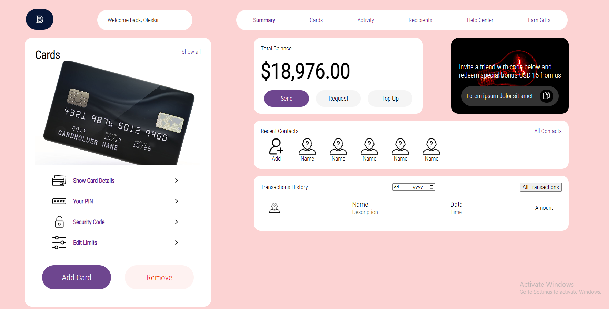
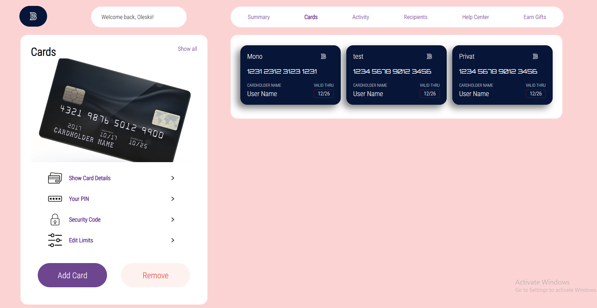
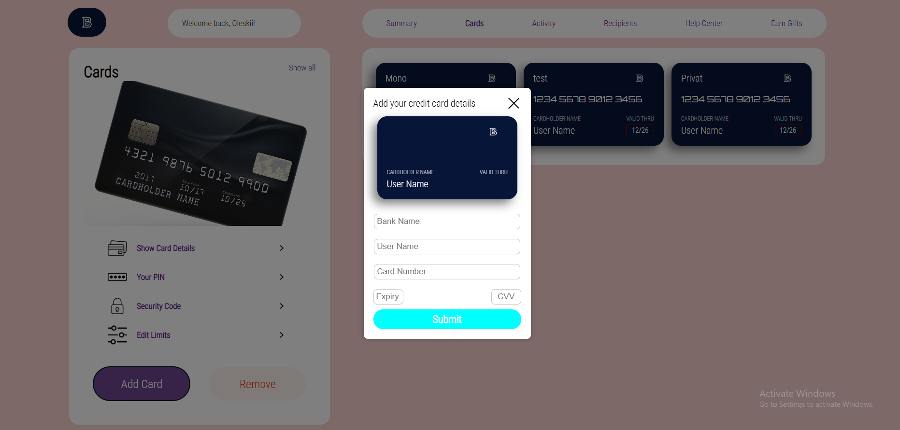
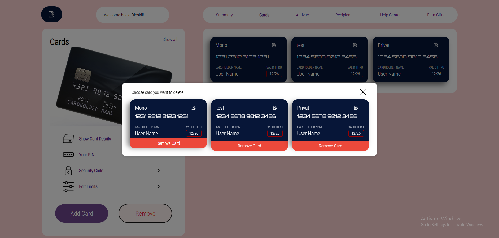

	

		
		
			
	

## 🧠 Project Overview

**Bankeu** is an educational/portfolio web application simulating a banking platform.  
It offers:

- User registration and authentication
- Account overview and transaction history
- Money transfers between users
- Basic financial operations and dashboards

(_This is a student project for learning purposes — not a real banking system._)

## :camera: Screenshots

### Dashboard

### Cards Page

### Add Card

### Remove Card

## 🚀 Stack & Technologies

This project uses the following technologies:

| Technology     | Purpose                                        |
| -------------- | ---------------------------------------------- |
| **React.js**   | Frontend library for building interactive UI   |
| **Module CSS** | Styling system for scoped CSS modules          |
| **Node.js**    | Backend runtime for server-side JavaScript     |
| **Express.js** | Web framework for building APIs                |
| **MongoDB**    | Database for storing user and transaction data |

  
Frontend

  <ul>
    <li><a href="https://reactjs.org/">React.js</a></li>
    <li><a href="https://developer.mozilla.org/en-US/docs/Web/CSS/Using_CSS_modules">Module CSS</a></li>
  </ul>

  
Backend

  <ul>
    <li><a href="https://nodejs.org/">Node.js</a></li>
    <li><a href="https://expressjs.com/">Express.js</a></li>
    <li><a href="https://www.mongodb.com/">MongoDB</a></li>
  </ul>

  
DevOps / Tools

  <ul>
    <li><a href="https://www.npmjs.com/">npm / yarn</a></li>
    <li><a href="https://www.mongodb.com/atlas">MongoDB Atlas (optional)</a></li>
  </ul>

## 📁 Features

- Fully responsive, modern UI built with **React + Tailwind**
- Type-safe frontend with **TypeScript**
- Fast dev + build using **Vite**
- Backend integration with **PHP** & **Composer**
- User authentication and secure sessions
- Transaction history and account management
- Simple transfer system between users
- Modular structure ready for future extensions
